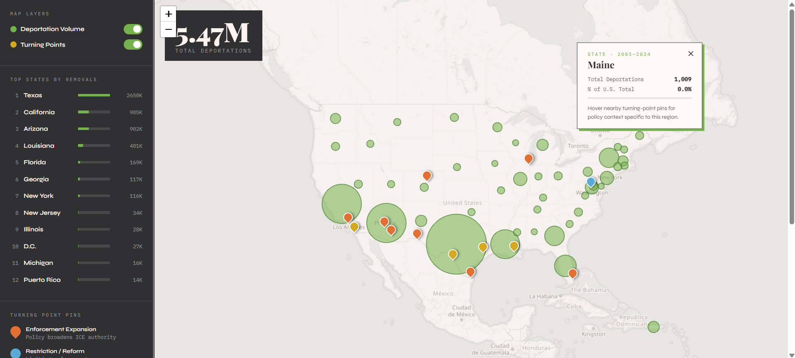

# ICE Deportations by State, FY 2003–2024

An interactive map of 5.47 million U.S. deportations over two decades, built with Leaflet.js. Each state is drawn as a circle scaled to its total removals, overlaid with 13 "turning point" pins marking the policy shifts and crises that shaped enforcement — from the 2006 Secure Border Initiative through Title 42, family separation, and the 2025 interior sweeps.

**Live project site:** https://tuatara-hbrypn.my.canva.site/

## What it shows

- **Deportation volume** — circle size and color encode total removals per state. Texas alone accounts for 48% of the national total; California, Arizona, and Louisiana follow.
- **Turning points** — color-coded pins (enforcement expansion, restriction/reform, flashpoint) with a short explainer for each event and the administration in office.
- **Sidebar** — ranked list of the top 12 states; click any row to zoom to it. Layer toggles let you isolate volume or policy events.

## Where it's used

The map is the centerpiece of a data story on the project site linked above, which walks through how deportation activity concentrated in the southwestern border corridor and then expanded into interior states through Secure Communities (2008–2014) and 287(g) agreements.

## Publication

This visualization will be published on the forthcoming research website of the **Center for Interdisciplinary Critical Inquiry (CICI) at UC Berkeley** (https://cici.berkeley.edu/), as part of its work on immigration enforcement. A direct link will be added here once the site launches.

## Data sources

- TRAC Immigration Reports (tracreports.org)
- DHS Yearbook of Immigration Statistics
- ICE ERO Annual Reports

## Running locally

Open `ice-deportations-map.html` in a browser. No build step — Leaflet and fonts load from CDN.

## Built with

Leaflet 1.9.4 · OpenStreetMap tiles · vanilla HTML/CSS/JS
